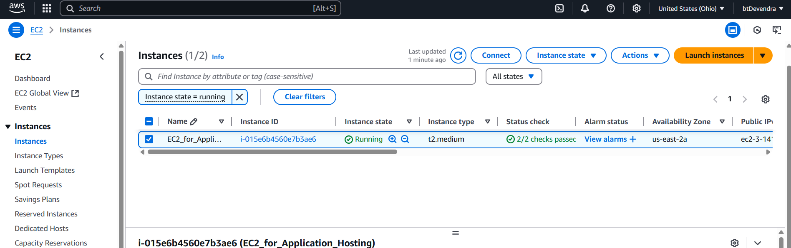
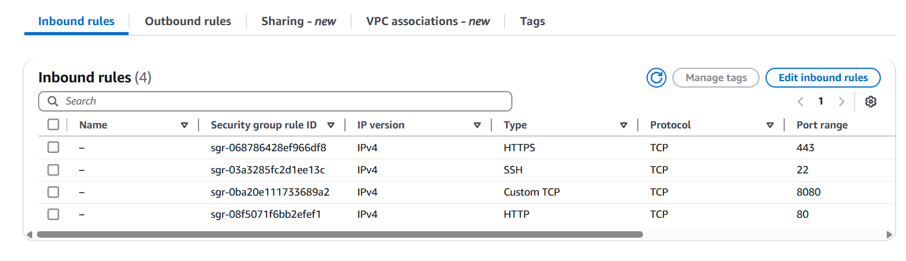
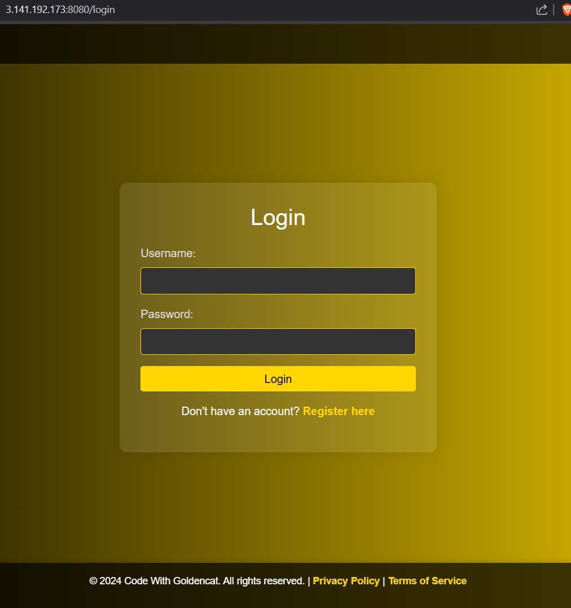
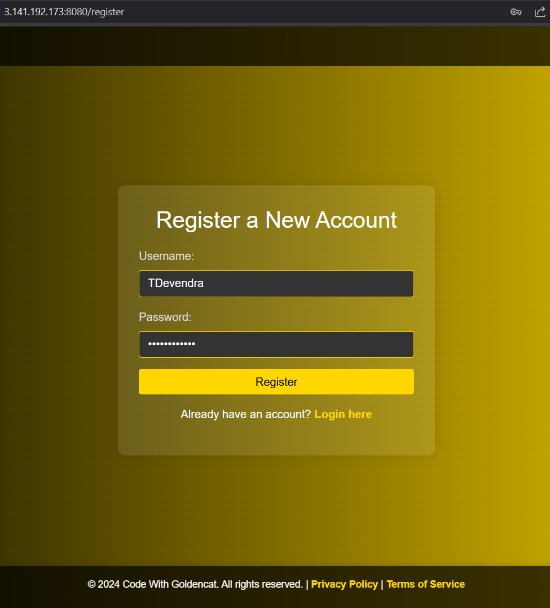
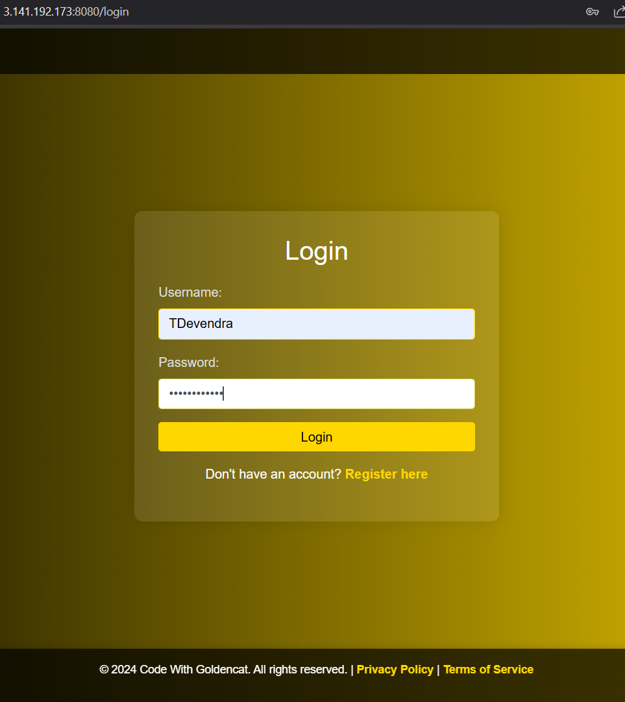
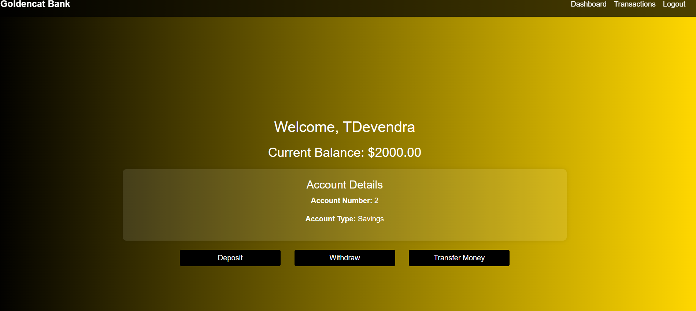

# 🏦 Spring Boot BankApp (Dockerized on AWS EC2)

This is a **Dockerized Spring Boot Banking Application** connected to **MySQL**, fully deployed on an **AWS EC2 instance** using Docker CLI.

It follows real-world deployment practices including container networking, health checks, and infrastructure isolation.  
📂 **Check the `Images/` folder to view full UI & setup screenshots.**

This project is perfect for demonstrating **cloud deployment, DevOps workflow, and freelance readiness**.

---

## 🚀 EC2 Docker Deployment Commands

Make sure EC2 instance has:
- ✅ Java installed (`sudo apt install openjdk-17-jdk -y`)
- ✅ Maven installed (`sudo apt install maven -y`)
- ✅ Docker installed (`sudo apt install docker.io -y`)

- 1. Copy & Paste below commands on EC2 terminal after EC2 connect or EC2 SSH
  2. Go to security group of Your EC2 & add port 8080 in inbound rules
     ---

## 📸 Application UI Screenshots

#### ✅ EC2 Instance Running  


#### ✅ EC2 Security Group Setup  


#### ✅ BankApp - Home Page  


#### ✅ BankApp - Account Registration


#### ✅ BankApp - Account Login 


#### ✅ BankApp - Account Transaction 


---
# Commnds to follow on EC2 terminal :

```bash
# Clone the repo
git clone https://github.com/TDevendra532/SpringBoot-BankingApp.git
cd SpringBoot-BankingApp

# Build the JAR file
mvn clean install

# Now, Create DockerFile for Application (Reffer Dockerfile)
vim Dockerfile
Esc + :wq

# Build Docker image
docker build -t devendra532/spring-bankapp:v1 .

# Create Docker network
docker network create bankapp-net

# Run MySQL container
docker run -d \
--name mysql \
--network bankapp-net \
-e MYSQL_ROOT_PASSWORD=Test@123 \
-e MYSQL_DATABASE=BankDB \
-v mysql_data:/var/lib/mysql \
-p 3306:3306 \
mysql:latest

# Run Spring Boot app container
docker run -d \
--name bankapp \
--network bankapp-net \
-e SPRING_DATASOURCE_URL="jdbc:mysql://mysql:3306/BankDB?useSSL=false&allowPublicKeyRetrieval=true&serverTimezone=UTC" \
-e SPRING_DATASOURCE_USERNAME=root \
-e SPRING_DATASOURCE_PASSWORD=Test@123 \
-p 8080:8080 \
devendra532/spring-bankapp:v1

# Push image to DockerHub
# First do docker login anmd enter Username & Password
docker login
docker tag spring-bankapp:v1 devendra532/spring-bankapp:v1
docker push devendra532/spring-bankapp:v1

# incase of docker-compose.yml (Skip above 3 steps)
docker compose up -d

# Application Deployed on EC2 :
App URL:       http://<EC2_PUBLIC_IP>:8080
Health URL:    http://<EC2_PUBLIC_IP>:8080/actuator/health

